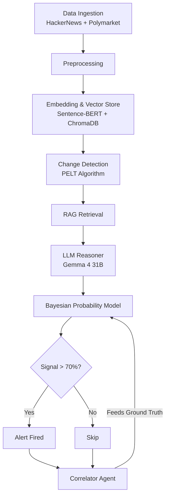

# 🧠 Agentic Insider Signal Detection Engine - Presentation Notes

These notes are designed to help you prepare for your presentation on the Agentic Insider Signal Detection Engine. They cover the core problem, your solution, the technical architecture, and key selling points.

## 🎯 The Core Concept
**The Problem**: Prediction markets like Polymarket reflect the crowd's belief about real-world outcomes. However, by the time prices move, the opportunity to capitalize is often gone. 
**The Hypothesis**: Before market prices move, early warning signals manifest as subtle shifts in online narratives. People with inside knowledge discuss things, rumors circulate, and framing changes.
**The Solution**: An autonomous pipeline that detects these narrative shifts on platforms like HackerNews **before** they are reflected in prediction market prices.

## 🏗️ Technical Architecture & Pipeline

The system is orchestrated using **LangGraph** and runs through an 8-step pipeline:

### Pipeline Breakdown
1. **Dynamic Ingestion**: Pulls trending topics directly from Polymarket API (crypto, politics, tech) and automatically scrapes relevant posts from HackerNews. Zero hardcoding of topics.
2. **Preprocessing**: Cleans the raw HackerNews data.
3. **Embedding**: Uses `sentence-transformers` (`all-MiniLM-L6-v2`) to convert text to 384-dimensional vectors, stored chronologically in **ChromaDB**.
4. **Change Detection (Drift)**: Uses the **PELT algorithm** (`ruptures` library) to flag when the semantic meaning of a topic's conversation suddenly shifts.
5. **RAG Retrieval**: Pulls the top-5 historically similar posts from ChromaDB to provide deep context.
6. **LLM Reasoning**: Uses **Gemma 4 31B** (via Ollama Cloud) to evaluate the current post, historical context, and market snapshot to declare a `SIGNAL` or `NO_SIGNAL`.
7. **Bayesian Calibration**: A dynamic probability model that tracks the AI's trustworthiness. It increases probability when signals are accurate and decreases on misses. Alerts fire at **>70% confidence**.
8. **Correlator Feedback Loop**: After a signal, this agent checks Polymarket to see if the price actually moved, feeding this "ground truth" back into the Bayesian model.

## 🛠️ Tech Stack Highlights
| Layer | Technology Used |
| :--- | :--- |
| **Data Sources** | Polymarket API, Algolia HackerNews API |
| **Embeddings & DB** | Sentence-BERT, ChromaDB |
| **Change Detection** | `ruptures` (PELT algorithm) |
| **LLM Engine** | Gemma 4 31B (via Ollama Cloud) |
| **Orchestration** | LangGraph |
| **UI / Dashboard** | Streamlit, Plotly |

## 📊 Dashboard Views (Streamlit)
You built the dashboard to cater to different audiences, which is a great talking point:
1. **Layman View**: Traffic lights & emojis. Simple English explanations.
2. **Analyst View**: Trend lines, drift score heatmaps, Bayesian gauges.
3. **Technical View**: Raw data, full LLM reasoning logs, CSV exports.

## 🚀 Key Talking Points for Presentation
> [!TIP]
> Emphasize these key features during your presentation to stand out:

- **Fully Autonomous & Dynamic**: The system doesn't rely on hardcoded keywords. It actively finds what's trending on Polymarket and searches for it on HackerNews.
- **Not Just Sentiment Analysis**: It doesn't just look for "happy" or "sad" words. It uses **Semantic Drift** (cosine distance over time) to detect when the *meaning* of the conversation changes.
- **Self-Correcting**: The combination of the Bayesian Model and the Correlator Agent means the system learns from its mistakes. If it predicts a shift and the market doesn't move, it penalizes itself so it's less likely to false-alarm next time.
- **Robust Orchestration**: Built on LangGraph, making the pipeline modular and easy to extend.

## 📍 Project Status
**Completed**:
- End-to-end 7-node LangGraph pipeline.
- Live ingestion, embeddings, changepoint detection.
- Gemma 4 reasoning, Bayesian model, and Correlator feedback loop.
- 3-view Streamlit dashboard.

**Next Steps (If asked)**:
- Deploying the dashboard to Streamlit Cloud.
- Optional QLoRA fine-tuning for edge cases.
